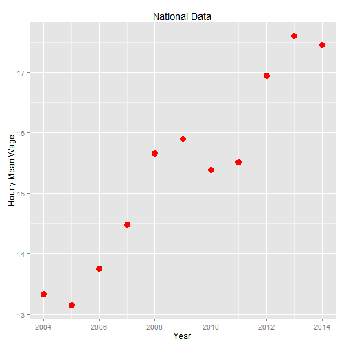

### Can you support yourself as a craft artist?

This shiny app reports on state and national employment data for craft artists from 2004 through 2014. Using it you can get an idea of:

* What the market looks like
     + The Bureau of Labor Statistics (BLS) tracks craft artist (excluding jewelry makers) as a separate occupation code. These are paid employees. 
     + The BLS estimates that self-employed craft artists account for 57% of crafters, with the BLS figures representing 43% of the market. 
     + With the growth of internet sites like Etsy, the market for craft sales has grown considerably. However, these artists usually do not earn enough for this to be their only source of income.

--- .class #id

### What you can learn from this app

* National and State information for:
     * Employment numbers - self-employed, paid employment, all employment
     * Earnings - Mean hourly wage and mean annual income (note that these are derived from reported income)
     
* Is the market growing?
     * In their [report](http://www.bls.gov/ooh/arts-and-design/craft-and-fine-artists.htm), the BLS reported a growth rate from 2012 to 2022 of approximately 3%. This is a slower than average growth rate according to the report.
     * Viewing the data will give you a good idea of the changes in employment and income over the 11 year period shown.

--- 

### Viewing the national data 

This is a sample of the national hourly wage data available through the app.

 

---

### Notes

Estimates of self-employed craft artists: These estimates use the BLS self-employed percentage. However BLS employment figures on which the estimate is based, reflect only artists employed by a third party. States with an active independent craft community but no reported third party employment, do not show up in the state data. 

Predictions: Not all states have data for every year and every variable. This causes the predictions to "drop out" when there is not enough information to predict for the number of years requested.

### References

Bureau of Labor Statistics, U.S. Department of Labor, Occupational Outlook Handbook, 2014-15 Edition, Craft and Fine Artists,
on the Internet at http://www.bls.gov/ooh/arts-and-design/craft-and-fine-artists.htm.

Bureau of Labor Statistics, U.S. Department of Labor, Occupational Employment Statistics, on the Internet at http://www.bls.gov/oes/tables.htm.

